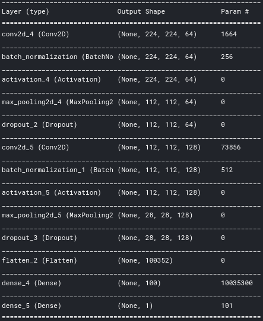

# Chest-X-Rays-Pneumonia-Detection

CNN was trained for detecting Pneumonia given Chest X-Rays. After training the model, test accuracy of 94.56% and a recall score of 0.97 was achieved.

## Dataset

[Kaggle | Chest X-Ray Images (Pneumonia)](https://www.kaggle.com/paultimothymooney/chest-xray-pneumonia) was used for training the model.

This dataset has 5863 images for the 2 classes.

Sample Images:

## Model

The trained model can be downloaded from the Output tab of the [Kaggle Kernel](https://www.kaggle.com/kartik2112/chest-x-ray-scans-pneumonia-identification/output?scriptVersionId=35394324)

## Models Comparison

* Model 1 - Convolutional, MaxPooling and Fully Connected Layers
* Model 2 - Convolutional, MaxPooling, Dropout and Fully Connected Layers
* Model 3 - Convolutional, Batch Normalization, MaxPooling, Dropout and Fully Connected Layers
* Model 4 - Convolutional, Batch Normalization, MaxPooling and Fully Connected Layers

## Model's Performance

## Model's Performance on Test Set

## Execution Details

The model was trained using Keras with TF backend on Kaggle Kernels using NVidia K80 GPU with 16 GB RAM.

## Links

* [Kaggle Kernel | Jatin Salve | Chest X-Ray Scans Pneumonia Identification](https://www.kaggle.com/jatinsalve/notebooka3e2a8c83b)
